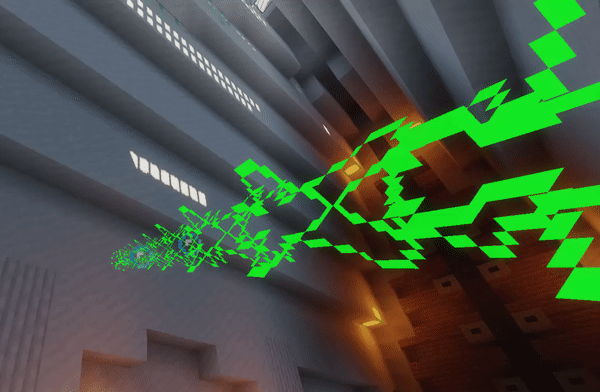

# GuardianBeam


An util to create easily Guardians and Ender Crystal Lasers via Packets and Reflection. No ProtocolLib, no dependency, compatible from Minecraft 1.9 to Minecraft 1.20!

Inspired by the plugin [GuardianBeamAPI by Jaxon A Brown](https://www.spigotmc.org/resources/18329), which uses ProtocolLib.

There is a [page on SpigotMC](https://www.spigotmc.org/threads/tutorial-laser-guardian-beam.348901/).



## How to install?
### 1st method: copying class
First, copy the [Laser.java class](src/main/java/fr/skytasul/guardianbeam/Laser.java) to your project.

### 2nd method: using maven
Add this requirement to your maven `pom.xml` file:

```xml
<dependency>
  <groupId>io.github.skytasul</groupId>
  <artifactId>guardianbeam</artifactId>
  <version>2.3.3</version>
  <scope>compile</scope>
</dependency>
```
Additionnally, you can use the maven shade plugin to relocate the class location.

## How to use?
1. Create Location objects of where do you want your laser starts and ends.
2. Create a Laser instance: `new GuardianLaser(locationStart, locationEnd, duration, visibleDistance)` - duration is the time (in seconds) when laser will be visible (if you set it to -1, the laser will exist infinitely), and visibleDistance is the amount of blocks where your laser will be visible. You can also use `new CrystalLaser(...)` to create an Ender Crystal laser.
3. After this, call the method `laser.start(plugin);` (where "plugin" parameter is the instance of your JavaPlugin class).
4. Ta-daaa! Your laser is created and shown to nearby players!
5. You can move the laser with the methods `laser.moveStart(newLocation);` and `laser.moveEnd(newLocation);`
6. To remove your laser before his end duration, just call `laser.stop();`

## Demo
Here is something I quickly made to show what you can do with this API: a ray-gun.


You can see the system in action [on this video](https://youtu.be/NSYMKsPBdMM), and the class is available [here](LaserDemo.java).

## Advanced usage
### Animations
The `Laser#moveStart(Location location, int ticks, Runnable callback` and `Laser#moveEnd(Location location, int ticks, Runnable callback)` methods can be used to make the laser move smoothly from one point to another.

Quick preview of the smooth movement:


### End runnable
If you want to execute some actions when the laser comes to its end, use the `Laser#executeEnd(Runnable runnable)` method.

In example:

```java
new GuardianLaser(start, end, duration, distance).executeEnd(() -> Bukkit.broadcastMessage("Laser ended!")).start(plugin);
```
This will start a laser for 10 seconds, after that the message "Laser ended!" will be broadcasted to users.

### Duration in ticks
The duration passed into the `new GuardianLaser(Location start, Location end, int duration, int distance)` constructor is in seconds. If you want it to be in ticks, call `Laser#durationInTicks()`.

In example:

```java
new GuardianLaser(start, end, durationInTicks, distance).durationInTicks().start(plugin);
```
This will start a laser for 10 ticks.

### Make guardian laser follow entity smoothly
As the laser is made out of a guardian entity shooting a laser at an entity, it is possible to make the laser follow
an existing entity of the world, without having to create a runnable which updates the laser position every tick.

To achieve this, you can either spawn the laser directly using this code:

```java
new GuardianLaser(start, endEntity, duration, distance).start(plugin);
```

Or, after spawning a laser with a custom end location, use `GuardianLaser#attachEndEntity(LivingEntity endEntity)` to track the entity.

You can also use a combination of `GuardianLaser#moveEnd(Location endLocation)` and `GuardianLaser#attachEndEntity(LivingEntity endEntity)` as many times and in the order you want.

Quick preview:


## Troubleshooting
Sometimes, Guardian beams only renders as bubbles, the moving color part is invisible.
It is not caused by this util but by a [Minecraft bug](https://bugs.mojang.com/browse/MC-165595).

It happens when your world gets too old (when its game time value reaches 2800000).
The only way to fix it is to open the `level.dat` file with a [NBT editor](https://github.com/jaquadro/NBTExplorer), and edit manually the `Data.Time` field to a lower value. Save the file, and start your server.

There is also a client bug which makes the Guardian beams completely invisible when too vertical. Adding a small offset to the top location when this issue occurs should fix it.